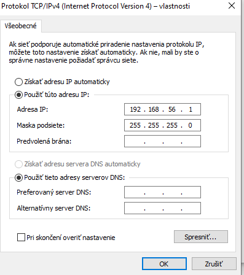
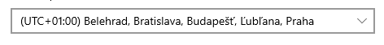

### ULOHA 1 SIETOVA DIAGNOSTIKA

**Zadanie (1/3)**
| Udaj | Hodnota |
|-----------|-----------|
| Ip adresa | 192.168.56.1 |
| Maska podsiete | 255.255.255.0 |
| Predvolena brana | 10.0.0.1 |

**Zadanie (2/3)**
| Udaj | Hodnota |
|-----------|-----------|
| DNS server | 10.0.0.1 |
| DHCP povolene | NIE |
| MAC adresa | 255.255.240.0 |

**Zadanie (3/3)**
| Prikaz| Vysledok |
|-----------|-----------|
| ping 127.0.0.1 | 0% loss ODPOVED |
| ping 8.8.8.8 | 0% loss ODPOVED |
| ping google.com | 0% loss ODPOVED |

### ULOHA 2 KONFIGURACIA SIETE

**Cas sa zmenil o 1 hodinu z 11:15 na 10:15**

**Synchronizacia bola overena**

