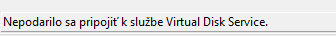

| Kategoria | Názov zariadenia |
|----------|----------|
| Grafické adaptéry | AMD Radeon HD 7560D|
| Zvukové vstupy a výstupy | Headphones a Microphone  |
| Sietové adaptéry |  Realtek PCIe GbE Family Controller VirtualBox Host-Only Ethernet Adapter WAN Miniport (IKEv2) WAN Miniport (IP) WAN Miniport (IPv6) WAN Miniport (L2TP) WAN Miniport (Network Monitor) WAN Miniport (PPPOE) WAN Miniport (PPTP) WAN Miniport (SSTP)   |
| Diskové jednotky | TOSHIBA DT01ACA050  |

# ULOHA 1 POKRACOVANIE

## 1. Nazov PC: PC-312-01

## OS: Windows 10 Pro Education 64-bitova verzia

## 2. Názov grafickej karty: AMD Radeon HD 7560D

## Velkost pamate: 497 MB

## 3. Headphones (High definition audio device)

--------Nie niesu rovnake, viacej v devmgmt.msc----------

# ULOHA 2 

| Udaj | Hodnota |
|----------|----------|
| Poskytovatel | Advanced micro device inc|
| Datum | 4.11 2015|
| Verzia | 15.201.1151.1008|
| Digital podpis | Microsoft Windows Hardware Compatibility Publisher|

## Prvy riadok: PCI\VEN_1002&DEV_9904&SUBSYS_99041849&REV_00

Nemam zvukovu kartu

ID HARDVARE: PCI\VEN_1002&DEV_9904&SUBSYS_99041849&REV_00

# ULOHA 3

| Udaj | Hodnota |
|----------|----------|
| Stranka vyrobcu | AMD support.com |
| Najnovsia verzia | 15.200.1062.0000 |
| Velkost suboru | 314M |
| Datum vydania | 2015-07-15 |

Nainstalovana verzia: Stara

Najnovsia dostupna: adrenaline edition 26.1.1

Aktualizacia potrebna: ano urcite 

# ULOHA 4

Kolko uloh: 3 ulohy

Posledna chyba: Warning

Kolko zdielani: 5 zdielani

Kolko uctov: 6 uctov

## Vidim rovnake zariadenia ako pri devmgmt.msc

## Ku sprave diskov nemam pristup: neviem zistit kolko diskov mame
